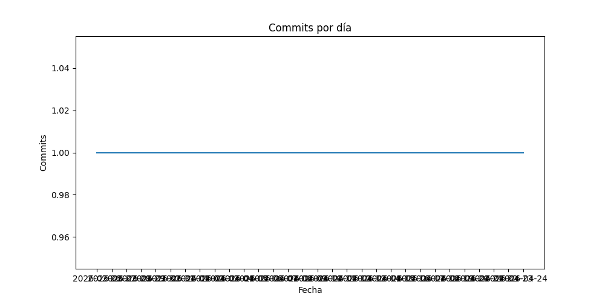

# FrankQu
### Hey everybody I'm Francisco: an aeronautical engineering student and a jr-dev

---
- I'm interested in aerospatial engineering!
- I'd like to improve my developer skills
---
```geojson
{
  "type": "FeatureCollection",
  "features": [
    {
      "type": "Feature",
      "id": 1,
      "properties": {
        "ID": 0
      },
      "geometry": {
        "type": "Polygon",
        "coordinates": [
          [
              [-90,35],
              [-90,30],
              [-85,30],
              [-85,35],
              [-90,35]
          ]
        ]
      }
    }
  ]
}
```


## My stats:


## Actualizaciones del README.md


